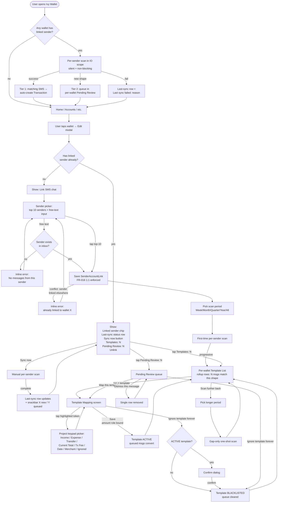
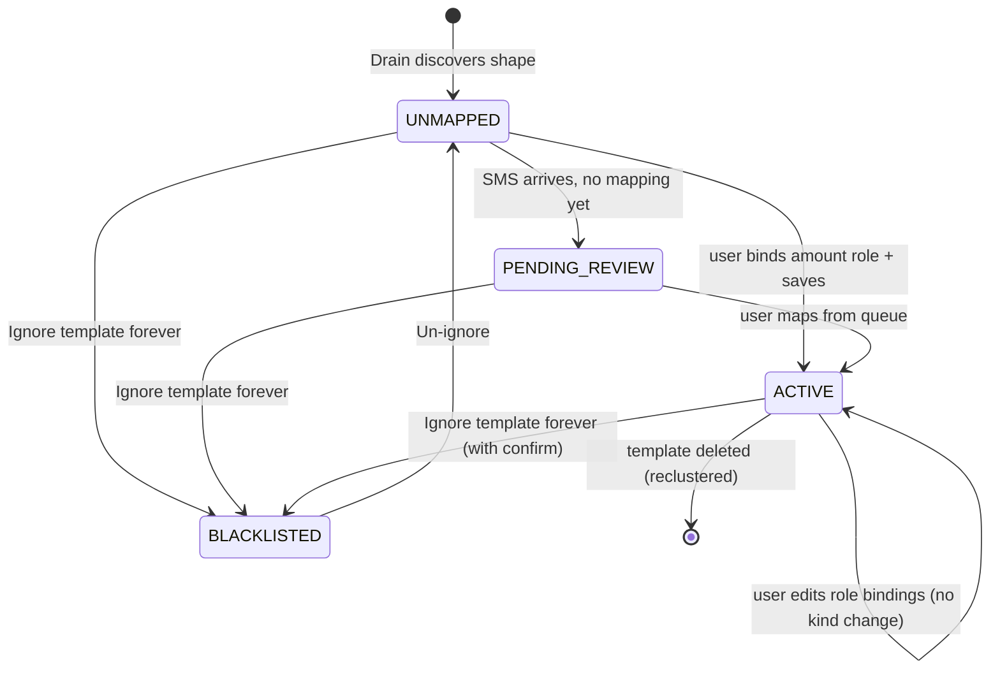
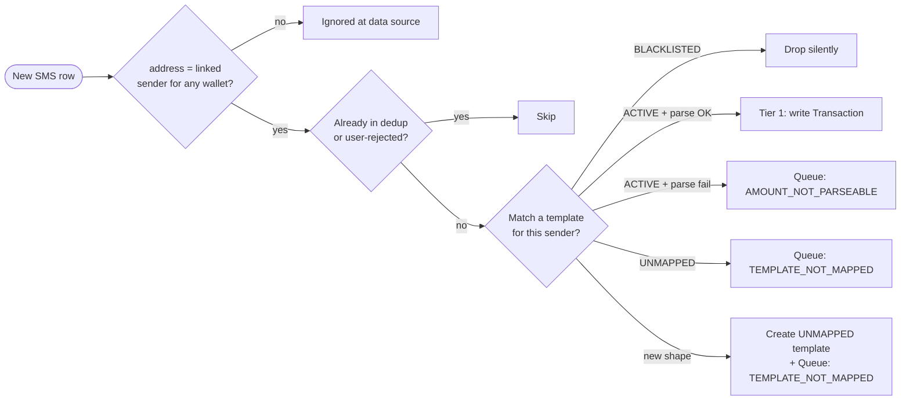

# SMS Extraction Engine — User Flow

**Audience**: implementer + reviewer
**Goal**: one-page picture of how the user moves from "open Ivy Wallet" to "auto-transactions land in my wallet" after the 2026-04-28 redesign. The point is a fast, predictable, per-wallet path with no global SMS surface.

## Top-level flow

## Why this flow is fast and reliable

- **No global surface.** All entry points live inside the wallet edit modal — the user never has to think "where is the SMS feature?" The wallet they care about IS the SMS context.
- **One sender per wallet.** Removes ambiguity. The `address = ?` filter on every SMS read keeps cursor scans tight (typically dozens of rows, not thousands).
- **Pull-only with launch sync + manual fallback.** No `BroadcastReceiver`, no `WorkManager`. If the launch scan fails, the last-sync row tells the user, and the "Sync now" button is the recovery path. No silent retries.
- **Per-sender watermark.** Each linked sender has its own last-processed timestamp; one sender's failures never block another wallet's progress.
- **Mark, don't remove.** Tokens are highlighted in their original example value, not replaced with `<*>`. The user reads natural-looking SMS text and recognizes the dynamic parts by color.
- **Eight-role keypad, no second classification step.** The amount role IS the transaction type. Saving requires only: pick the amount role + (optional) date / merchant / etc.
- **One ignore-forever button.** "Ignore this template forever" is the same destination from the template list, the mapping screen, and any pending-review item — the user never has to learn a different word for the same outcome.

## Per-screen render direction

`LayoutDirection` is decided at the body level by the first non-whitespace character:

| First char in inbox block | Direction | Notes |
|---|---|---|
| `؀`–`ۿ` (Arabic) | Rtl | Includes Arabic-Indic digits |
| `ݐ`–`ݿ` (Arabic Supplement) | Rtl | |
| `ﭐ`–`﷿`, `ﹰ`–`` (Arabic Pres. Forms) | Rtl | |
| anything else | Ltr | Latin, Cyrillic, digits, punctuation |

Per-message check at render time. Mixed-script bodies follow the first character (acceptable for single-user scope).

## State machine for `SmsTemplate`

Notes:
- `BLACKLISTED → ACTIVE` is intentionally **not** a direct edge. After un-ignoring, the user must re-bind roles and re-save.
- A template's kind (Income / Expense / Transfer) is implied by which amount-role wildcard is bound; there is no separate enum field on the template.

## Routing one incoming SMS

Currency-mismatch detection runs as part of "parse OK" — a body currency that contradicts the wallet's currency drops the row to the queue with `CURRENCY_MISMATCH`.
